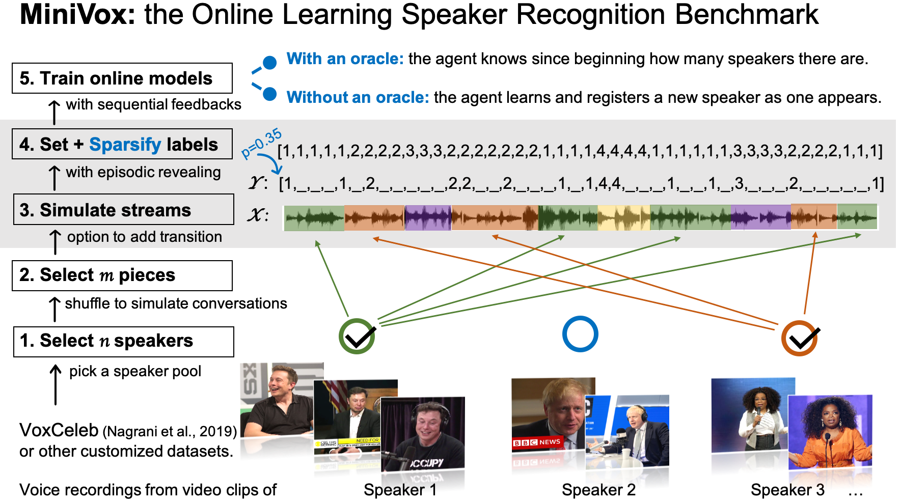

# MiniVox

Code for our paper: 

**"Speaker Diarization as a Fully Online Learning Problem in MiniVox"** 

by [Baihan Lin](https://www.baihan.nyc/) (Columbia) and [Xinxin Zhang](https://www.estherzhang.com/) (UW). 

For the latest full paper: https://arxiv.org/abs/2006.04376

All the experimental results can be reproduced using the code in this repository. Feel free to contact me by doerlbh@gmail.com if you have any question about our work.

**Abstract**

We proposed a novel machine learning framework to conduct real-time multi-speaker diarization and recognition without prior registration and pretraining in a fully online learning setting. Our contributions are two-fold. First, we proposed a new benchmark to evaluate the rarely studied fully online speaker diarization problem. We built upon existing datasets of real world utterances to automatically curate \textit{MiniVox}, an experimental environment which generates infinite configurations of continuous multi-speaker speech stream. Second, we considered the practical problem of online learning with episodically revealed rewards and introduced a solution based on semi-supervised and self-supervised learning methods. Additionally, we provided a workable web-based recognition system which interactively handles the cold start problem of new user's addition by transferring representations of old arms to new ones with an extendable contextual bandit. We demonstrated that our proposed method obtained robust performance in the online MiniVox framework.   

## Info

Language: Matlab

Platform: MacOS, Linux, Windows

by Baihan Lin, Jan 2020

## Citation

If you find this work helpful, please try out the models and cite our works. Thanks!

    @article{lin2020speaker,
      title={Speaker Diarization as a Fully Online Learning Problem in MiniVox},
      author={Lin, Baihan and Zhang, Xinxin},
      journal={arXiv preprint arXiv:2006.04376},
      year={2020}
    }

## Requirements

* Matlab
* MatConvNet: https://www.vlfeat.org/matconvnet/

## Acknowledgements 

The CNN pretrained model was accessed from https://github.com/a-nagrani/VGGVox. We modified many of the original files and included our comparison.

